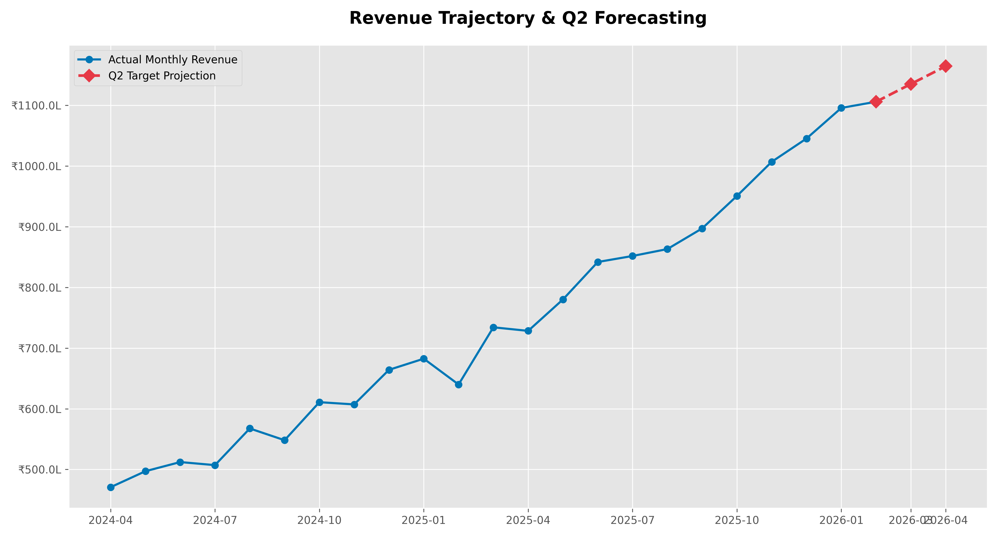
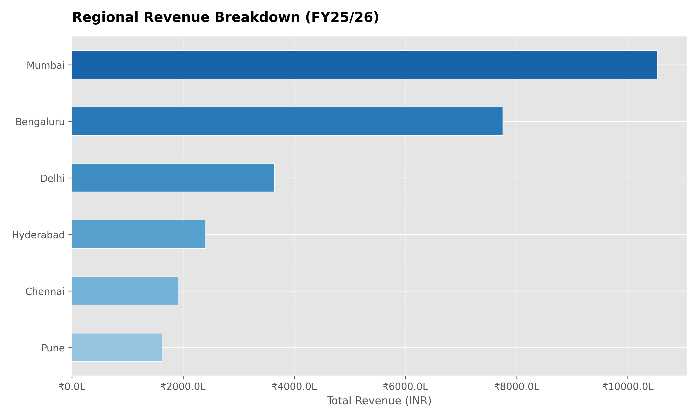

 India Sales Forecasting & Analytics Pipeline

A robust Python-based ETL (Extract, Transform, Load) system designed to simulate, process, and forecast e-commerce revenue trends for major Indian metropolitan hubs.

 Project Overview
This project demonstrates a full data lifecycle, from generating synthetic transaction data to producing executive-level predictive visualizations. It accounts for regional market dynamics and uses linear regression to project future performance.

 Key Technical Features
 
 Data Engineering: Automated generation of 20,000+ transaction records.
 Market Weighting: Applied a 1.25x revenue multiplier for Tier-1 cities (Mumbai & Bengaluru) to simulate higher purchasing power.
 Predictive Modeling: Implemented a Linear Regression model to forecast Q2 2026 revenue.
 Anchored Forecasting: Developed a seamless transition logic that connects historical data points directly to projections to eliminate statistical variance gaps.

 Visualizations
 
1. Revenue Trajectory & Q2 Forecast

This chart displays historical monthly revenue (April 2024 – Feb 2026) and projects growth into the next quarter.

 3. Regional Revenue Distribution
    
A breakdown of total revenue by city, highlighting the dominance of key market hubs.

 Technical Stack
 
 Language: Python 3.10+
 Libraries:Pandas, NumPy, Matplotlib
 Methodology: Object-Oriented Programming (OOP)
